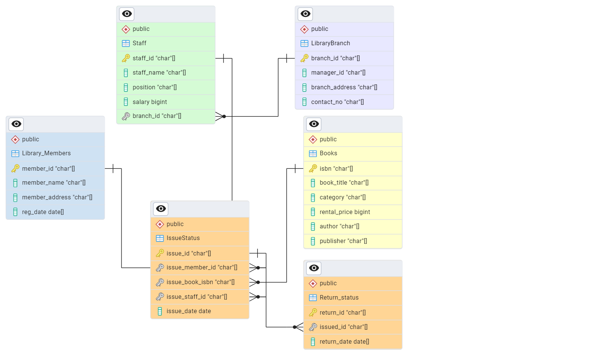

# 📚 Library Management System (SQL) 🚀

This project demonstrates the power of SQL in building a robust Library Management System (LMS). We'll explore database design, CRUD operations, advanced queries, and how SQL transforms traditional bookkeeping. Let's dive in! 📖✨

## 🏗️ Database Schema

The system consists of the following tables, designed to efficiently manage library resources:

-   **🏢 LibraryBranch:** Stores branch details (branch ID, manager ID, address, contact).
-   **🧑‍💼 Staff:** Stores staff information (staff ID, name, position, salary, branch ID).
-   **👥 LibraryMembers:** Stores member details (member ID, name, address, registration date).
-   **📖 Books:** Stores book information (ISBN, title, category, rental price, status, author, publisher).
-   **📝 IssueStatus:** Tracks book borrowing (issue ID, member ID, book ISBN, issue date, staff ID).
-   **↩️ ReturnStatus:** Tracks book returns (return ID, issue ID, return date).

## 🚀 Setup Instructions

1.  **💾 Database Creation:**
    -   Create a database named `library_system`.
    -   Execute the SQL script (`library_system.sql`) to create tables and insert sample data.

2.  **▶️ SQL Script Execution:**
    -   Use a SQL client (e.g., MySQL Workbench, pgAdmin, SQL Server Management Studio).
    -   Run the script to build your library database.

## 💡 SQL Queries and Functionalities

### 📚 What is a Relational Database?

A relational database organizes data into tables with rows and columns. Relationships between tables are established using keys, ensuring data integrity and reducing redundancy. SQL (Structured Query Language) is the standard language for managing relational databases.

### 🛠️ CRUD Operations

CRUD (Create, Read, Update, Delete) operations are fundamental to database management.

-   **📝 Create (INSERT):**
    ```sql
    INSERT INTO LibraryMembers (member_id, member_name, member_address, reg_date)
    VALUES ('2022CSB14STU', 'New Member', 'New Address', '2024-04-01');
    ```

-   **🔍 Read (SELECT):**
    ```sql
    SELECT book_title, author FROM Books WHERE category = 'Computer Science';
    ```

-   **🔄 Update (UPDATE):**
    ```sql
    UPDATE Books SET rental_price = 9.99 WHERE isbn = '978-1-593-27082-7';
    ```

-   **🗑️ Delete (DELETE):**
    ```sql
    DELETE FROM LibraryMembers WHERE member_id = '2022CSB14STU';
    ```

### 📊 Data Analysis and Reporting

-   **📈 Counting Books by Category:**
    ```sql
    SELECT category, COUNT(*) AS book_count FROM Books GROUP BY category ORDER BY book_count DESC;
    ```

-   **💰 Finding Total Rental Income:**
    ```sql
    SELECT category, SUM(rental_price) AS total_rental_income FROM Books GROUP BY category;
    ```

-   **⏳ Finding Overdue Books:**
    ```sql
    SELECT ist.issued_member_id,
      m.member_name,
      bk.book_title,
      ist.issued_date,
      CURRENT_DATE - ist.issued_date AS overdue_days
    FROM issued_status ist JOIN members m ON m.member_id = ist.issued_member_id
    JOIN books bk ON bk.isbn = ist.issued_book_isbn
    LEFT JOIN return_status rs ON rs.issued_id = ist.issued_id
    WHERE rs.return_date IS NULL AND (CURRENT_DATE - ist.issued_date) > 30
    ORDER BY overdue_days DESC;
    ```

### 🏢 Branch-wise Reports

-   **📊 Generating Branch Reports:**
    ```sql
    SELECT lb.branch_id, COUNT(DISTINCT iss.issued_id)
        AS total_books_issued,
        COUNT(DISTINCT ret.return_id) AS total_books_returned,
        COALESCE(SUM(b.rental_price), 0) AS total_revenue
    FROM LibraryBranch lb LEFT JOIN Staff s ON lb.branch_id = s.branch_id
    LEFT JOIN IssueStatus iss ON s.staff_id = iss.issued_staff_id
    LEFT JOIN ReturnStatus ret ON iss.issued_id = ret.issued_id
    LEFT JOIN Books b ON iss.issued_book_isbn = b.isbn
    GROUP BY lb.branch_id
    ORDER BY total_books_issued DESC;
    ```

## 💖 Motivation: From Traditional Bookkeeping to SQL

**Traditional Bookkeeping:** Imagine a library where records are maintained manually in ledgers. Finding a book's status, calculating overdue fines, or generating reports would be time-consuming and prone to errors.

**SQL Transformation:** SQL automates these tasks, making them fast and accurate. With SQL, I can:

-   **🔍 Instantly find any book or member.**
-   **⚡ Generate real-time reports.**
-   **✅ Maintain data integrity and consistency.**
-   **📈 Analyze library data to improve operations.**

I love how SQL transforms complex data management into simple, efficient queries. It's like having a super-powered assistant that handles all the tedious tasks, allowing me to focus on what matters most. 🌟

## 🛠️ Technologies Used

-   SQL (PostgreSQL)

## 🚀 Potential Enhancements

-   🌐 Implement a web-based user interface.
-   📱 Integrate barcode scanning for efficient check-in/check-out.
-   🔒 Add user authentication and authorization.
-   🔔 Implement automated overdue notifications.
-   📈 Create advanced analytics dashboards.

## 🤝 How to Contribute

Contributions are welcome! Feel free to submit pull requests or open issues. Let's make this LMS even better! 🚀✨
